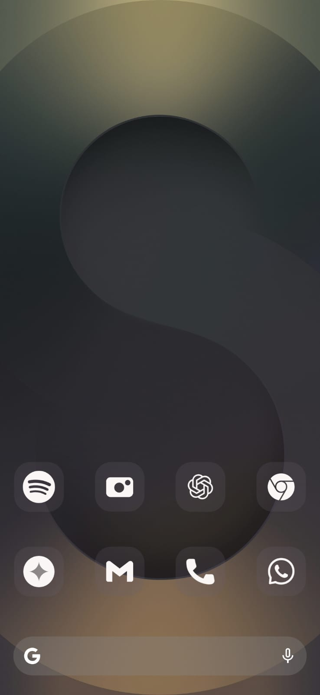

# Customizable Google Search Bar Widget

This is an Android home screen widget that provides a **customizable Google Search Bar** with a modern design. Users can personalize the widget's appearance, including background color, transparency, icon color, and corner radius.

## Features
- **Customizable Background**: Users can change the background color and transparency.
- **Rounded Corners**: Adjustable corner radius for a sleek look.
- **Custom Icon Colors**: Change the color of the search and mic icons.
- **One-Tap Search**: Tap the search bar to launch the Google search.
- **Minimalist Design**: Inspired by modern Android UI aesthetics.

## Preview


## Installation
1. Clone this repository or download the source code.
   ```sh
   git clone https://github.com/arkadeepnag/searchWidget
   ```
2. Open the project in **Android Studio**.
3. Build and install the APK on your device.
4. Add the widget to your home screen from the **Widgets menu**.

## Customization Options
You can modify the widget's settings using `SharedPreferences`:
- **Background color** (`bg_color`)
- **Transparency** (`transparency`)
- **Corner radius** (`radius`)
- **Icon color** (`icon_color`)

These values are stored in `WidgetPrefs_{appWidgetId}`.

## Usage
- **Tap the widget** to open Google Search.
- Customize it through the widget settings panel in your app.

## License
This project is licensed under the **MIT License**.

---

